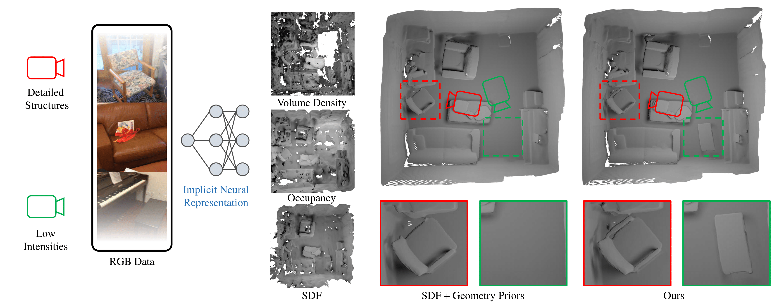

<p align="center">

  <h1 align="center">Learning A Room with the Occ-SDF Hybrid: Signed Distance Function Mingled with Occupancy Aids Scene Representation</h1>
  <p align="center">
    <a href="http://shawlyu.github.io/">Xiaoyang Lyu</a>
    ·
    <a href="https://daipengwa.github.io/">Peng Dai</a>
    ·
    <a href="https://kyleleey.github.io/">Zizhang Li</a>
    ·
    <a href="http://starydy.xyz/about/">Dongyu Yan</a>
    ·
    <a href="https://scholar.google.com.hk/citations?user=29otYD8AAAAJ&hl=en">Yi Lin</a> 
    ·
    <a href="https://www.eee.hku.hk/~evanpeng/">Yifan (Evan) Peng</a> 
    ·
    <a href="https://xjqi.github.io/">Xiaojuan Qi</a> 
  </p>
  <h3 align="center">ICCV 2023</h3>
  <h3 align="center"><a href="https://arxiv.org/pdf/2303.09152">Paper</a> | <a href="https://shawlyu.github.io/Occ-SDF-Hybrid/">Project Page</a></h3>
  <div align="center"></div>
</p>

<p align="center">
  <a href="">
    
  </a>
</p>

<p align="left">
<strong>TL; DR:</strong> Implicit neural rendering has made impressive strides in the surface reconstruction of large-scale scenes. However, applyding previous method to reconstruct a room-level scene from images may miss structures in low-intensity areas and/or small, thin objects.
We have conducted experimetns on three datasets to identify limitations of the original color rendering loss and priors-embedded SDF scene representation.
</p>
<br>

# TODO
- [x] Create the project page
- [x] Create the README file
- [x] Opensource all the training code
- [ ] Opensource all the models and meshes
- [ ] Replica data preparation scripts
- [ ] Real data preparation scripts
- [ ] MonoUNISURF and MonoVolSDF

# Setup
## Installation
Clone the repository and create an anaconda environment called occ-sdf using
```
git clone git@github.com:shawLyu/Occ-SDF-Hybrid.git
cd Occ-SDF-Hybrid

conda env create -f env.yaml
```
The hash encoder will be compiled on the fly when running the code.

## Dataset
This project mainly inherits from the [MonoSDF](https://github.com/autonomousvision/monosdf), thus the dataset can be downloaded like [Monosdf](https://github.com/autonomousvision/monosdf), through
```
bash scripts/download_dataset.sh
```

# Training
Run the following command to train OCC-SDF:
```
cd ./code
CUDA_VISIBLE_DEVICES=0 python -m torch.distributed.launch --nproc_per_node 1 --nnodes=1 --node_rank=0 training/exp_runner.py --conf CONFIG --scan_id SCAN_ID 
```
where CONFIG is the config file in code/confs, and SCAN_ID is the id of the scene to reconstruct.

<font color='red'>If you want to train the network on the single machine with different GPU, you can add `--master_port <port_number>`</font>

We provide example commands for training Replica, ScanNet, and Tanks and Temples dataset as follows:
```
# Replica (room0)
CUDA_VISIBLE_DEVICES=0 python -m torch.distributed.launch --master_port 25585 --nproc_per_node 1 --nnodes=1 --node_rank=0 training/exp_runner.py --conf confs/replica_mlp_hybrid.conf --scan_id 1

# Scannet (scene_0050_00)
CUDA_VISIBLE_DEVICES=0 python -m torch.distributed.launch --master_port 25585 --nproc_per_node 1 --nnodes=1 --node_rank=0 training/exp_runner.py --conf confs/scannet_mlp_hybrid.conf --scan_id 1

# Tanks and Temples (MLP)
CUDA_VISIBLE_DEVICES=0 python -m torch.distributed.launch --master_port 25585 --nproc_per_node 1 --nnodes=1 --node_rank=0 training/exp_runner.py --conf confs/tnt_mlp_hybrid.conf --scan_id 1

# Tanks and Temples (Grids)
CUDA_VISIBLE_DEVICES=0 python -m torch.distributed.launch --master_port 25585 --nproc_per_node 1 --nnodes=1 --node_rank=0 training/exp_runner.py --conf confs/tnt_grids_hybrid.conf --scan_id 1
```

# Evaluations
## Replica
Evaluate on one scene (take scan 1 room0 for example)
```
cd replica_eval
python evaluate_single_scene.py --input_mesh replica_scan1_mesh.ply --scan_id 1 --output_dir replica_scan1
```
Evaluate all Replica Scenes: 

```
cd replica_eval
python evaluate_avg.py
```
please check the script for more details.
## ScanNet
```
cd scannet_eval
python evaluate_avg.py
```
please check the script for more details.
## Tanks and Temples
Please follow the [MonoSDF](https://github.com/autonomousvision/monosdf) for more details.


# Acknowledgements
This project is built upon [MonoSDF](https://github.com/autonomousvision/monosdf). We thank all the authors for their great work and repos.

# Citation
If you find our code or paper useful, please cite
```
@inproceedings{Lyu2023occsdf,
  title={Learning A Room with the Occ-SDF Hybrid: Signed Distance Function Mingled with Occupancy Aids Scene Representation},
  author={Xiaoyang Lyu, Peng Dai, Zizhang Li, Dongyu Yan, Yi Lin, Yifan Peng, Xiaojuan Qi},
  booktitle={Proceedings of the IEEE/CVF international conference on computer vision},
  year={2023}
}
```